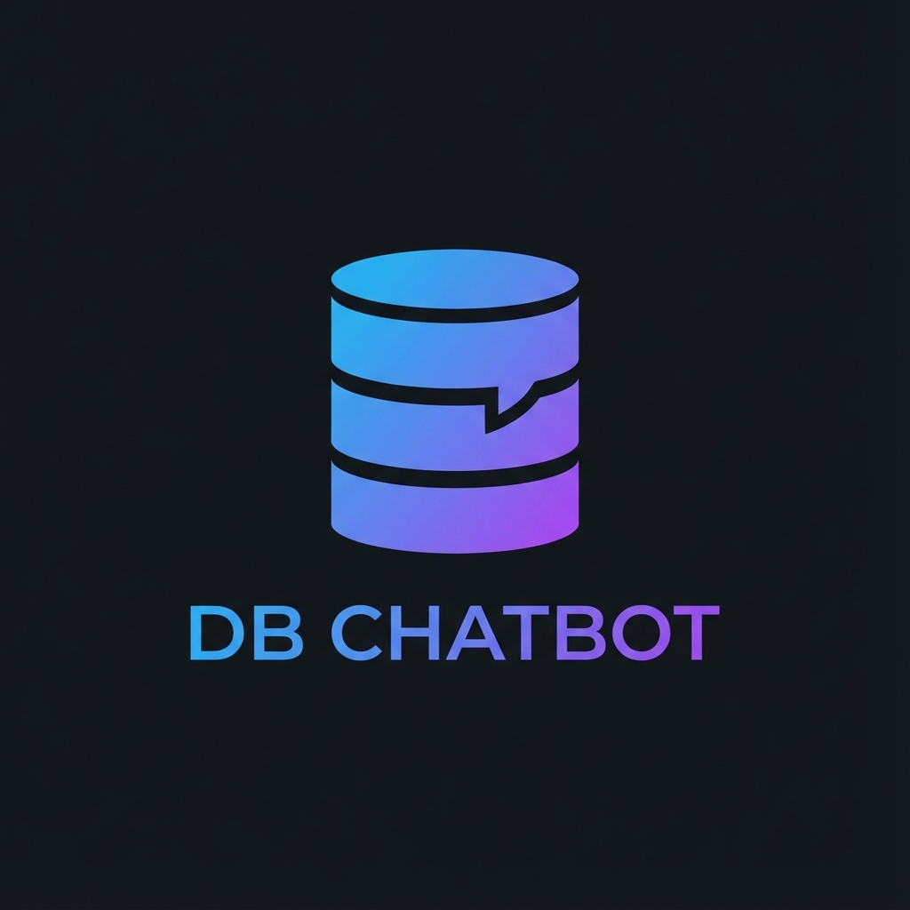

# Sales Assistant (DB Chatbot)

A powerful, AI-driven chatbot that bridges the gap between natural language and your database. This application allows users to query sales data using plain English, powered by **Google Gemini** for intent recognition and query generation, and **MongoDB** for data storage.



## 🚀 Features

-   **Natural Language Querying**: Converts specialized questions (e.g., "Show me sales for Tesla") into executable MongoDB aggregation pipelines.
-   **Company Context**: Dynamic dropdown to switch context between different companies (Google, Microsoft, Apple, Tesla, Amazon).
-   **Hybrid Intelligence**: Seamlessly switches between database querying (for data requests) and general conversational AI (for explanations and chit-chat).
-   **Persistent History**: Chat history is stored in MongoDB and automatically restored across sessions.
-   **Modern UI**: A premium, dark-mode specialized React interface with a responsive design.

## 🛠️ Tech Stack

### Backend
-   **Framework**: FastAPI (Python)
-   **AI Model**: Google Gemini 2.5 Flash
-   **Database**: MongoDB (via Motor async driver)
-   **Language**: Python 3.10+

### Frontend
-   **Framework**: React (Vite)
-   **Styling**: Modern CSS3 (Variables, Flexbox, Glassmorphism)
-   **Icons**: Lucide React

## 📦 Installation & Setup

### Prerequisites
-   Node.js & npm
-   Python 3.10+
-   MongoDB Atlas Cluster (or local instance)
-   Google AI Studio API Key

### 1. Backend Setup

Navigate to the backend directory:
```bash
cd backend
```

Create a virtual environment (optional but recommended):
```bash
python -m venv venv
# Windows
.\venv\Scripts\activate
# Mac/Linux
source venv/bin/activate
```

Install dependencies:
```bash
pip install -r requirements.txt
```

Create a `.env` file in the `backend` folder:
```env
GOOGLE_API_KEY=your_gemini_api_key
MONGODB_URL=your_mongodb_connection_string
DB_NAME=your_database_name
COLLECTION_NAME=your_collection_name
```

Run the server:
```bash
uvicorn app.main:app --reload
```
The backend will start at `http://localhost:8000`.

### 2. Frontend Setup

Navigate to the frontend directory:
```bash
cd frontend
```

Install dependencies:
```bash
npm install
```

Run the development server:
```bash
npm run dev
```
The application will open at `http://localhost:5173`.

## 🚀 Deployment

### Backend (Render)
config:
-   **Build Command**: `pip install -r requirements.txt`
-   **Start Command**: `uvicorn app.main:app --host 0.0.0.0 --port 10000`

### Frontend (Vercel)
config:
-   **Framework Preset**: Vite
-   **Root Directory**: `frontend`
-   **Environment Variables**: `VITE_API_URL` = `https://your-backend-url.onrender.com`

## 📂 Project Structure

```
DB_Chatbot/
├── backend/            # FastAPI Application
│   ├── app/
│   │   ├── main.py     # Entry point
│   │   ├── services/   # DB & LLM Logic
│   │   └── models/     # Pydantic Models
│   └── requirements.txt
│
└── frontend/           # React Application
    ├── public/         # Static assets (logo)
    ├── src/
    │   ├── components/ # React Components (ChatInterface, etc.)
    │   └── styles/     # CSS Styles
    └── vite.config.js
```
